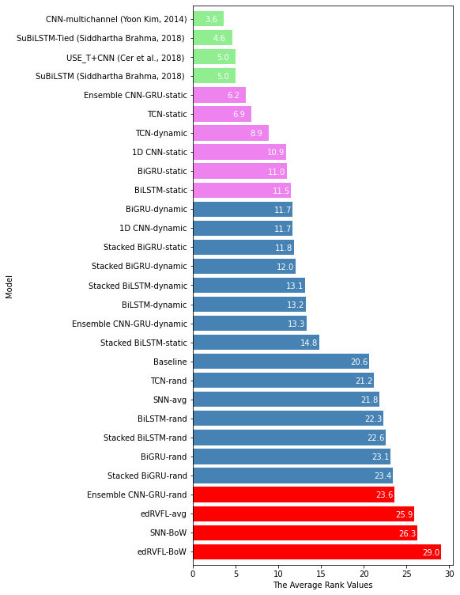
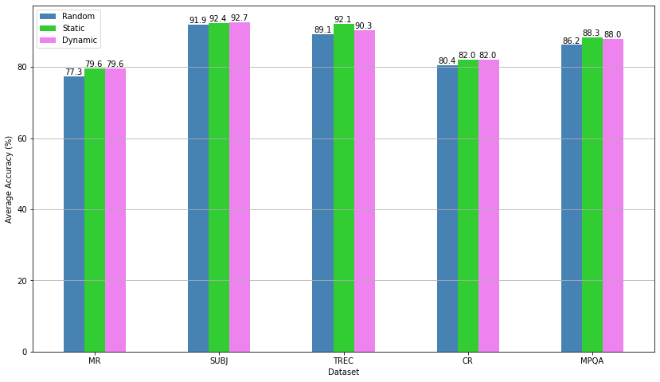

# Deep Learning Techniques for Text Classification
Master Thesis Project at Nanyang Technological University
- __Documentation__: [Project Blogpost](https://diardano.medium.com/deep-learning-techniques-for-text-classification-78d9dc40bf7c), [Project Report](https://github.com/diardanoraihan/Coursera_Capstone/blob/main/document/Project_Report_The_Battle_of_Neighborhoods.pdf)
- __Author__: Diardano Raihan 
- __Email__: diardano@gmail.com
- __Social Media__: [LinkedIn](https://www.linkedin.com/in/diardanoraihan), [Medium](https://diardano.medium.com/)

## Project Summary
The experiment will evaluate the performance of some popular deep learning models, such as feedforward, recurrent, convolutional, and ensemble-based neural networks, on five different datasets. We will build each model on top of two separate feature extractions to capture information within the text. 

The result shows that the __word embedding provides a robust feature extractor__ to all the models in making a better final prediction. The experiment also highlights __the effectiveness of the ensemble-based__ and __temporal convolutional neural network__ in achieving good performances and even competing with the state-of-the-art benchmark models.

## Datasets
| Dataset | Classes | Average   Sentence Length | Dataset Size | Vocab Size | *Test Size | 
|:-------:|:-------:|:-------------------:|:------------:|:----------:|:---------:|
| `MR`    | 2       | 20                  | 10662        | 18758      | CV        |
| `SUBJ`  | 2       | 23                  | 10000        | 21322      | CV        |
| `TREC`  | 5       | 10                  | 5952         | 8759       | 500       |
| `CR`    | 2       | 19                  | 3775         | 5334       | CV        |
| `MPQA`  | 2       | 3                   | 10606        | 6234       | CV        |
- __MR__. Movie Reviews – classifying a review as positive or negative [1]. [link](https://www.cs.cornell.edu/people/pabo/movie-review-data/)
- __SUBJ__. Subjectivity – classifying a sentence as subjective or objective [2]. [link](https://www.cs.cornell.edu/people/pabo/movie-review-data/)
- __TREC__. Text REtrieval Conference – classifying a question into six categories (a person, location, numeric information, etc.) [3]. [link](https://cogcomp.seas.upenn.edu/Data/QA/QC/)
- __CR__. Customer Reviews – classifying a product review (cameras, MP3s, etc.) as positive or negative [4]. [link](https://www.cs.uic.edu/~liub/FBS/sentiment-analysis.html)
- __MPQA__. Multi-Perspective Question Answering – opinion polarity detection [5]. [link](http://mpqa.cs.pitt.edu/)

_*the test size CV stands for cross-validation. It indicates the original dataset does not have a standard train/test split. Hence, we use a 10-fold CV. The __AcademiaSinicaNLPLab__ [6] repository provides access to all these datasets._

## The Proposed Deep Learning Models
| *Model | Bag-of-Words | WE-avg| WE-random | WE-static | WE-dynamic |
| :---: | :---: | :---: | :---: | :---: | :---: |
| SNN | ✓ | ✓ | - | - | - |
| edRVFL | ✓ | ✓ | - | - | - |
| 1D CNN | - | - | ✓ | ✓ | ✓ |
| TCN | - | - |  ✓ | ✓ | ✓ |
| BiGRU/BiLSTM | - | - |  ✓ | ✓ | ✓ |
| Stacked BiGRU/BiLSTM | - | - | ✓ | ✓ | ✓ |
| Ensemble CNN-GRU | - | - |  ✓ | ✓ | ✓ |\

WE: word embedding (Word2Vec, GloVe, FastTExt, BERT, etc).

_*For all models, the training process is done using an early stopping where the model will stop training before it overfits the training data_.

The benchmarks used in this work:
- __CNN-multichannel__ (Yoon Kim, 2014) [7]
- __SuBiLSTM__ (Siddhartha Brahma, 2018) [8]
- __SuBiLSTM-Tied__ (Siddhartha Brahma, 2018) [8]
- __USE_T+CNN__ (Cer et al., 2018) [9]

## Result
### The proposed models against benchmarks

| Model | _MR_ | _SUBJ_ |_TREC_ | _CR_ | _MPQA_ |
|:----- |:---:|:---:|:---:|:---:|:---:|
| edRVFL-BoW	| 76.2	| 89.4	| 75.2	| 78.0	| 85.0 |
| edRVFL-avg	| 77.0	| 90.6	| 83.6	| 78.5	| 86.7 |
| SNN-a/b/c-BoW	|77.4	|90.8	|76.2	|79.7	|86.0|
| SNN-c-avg	|78.3	|91.6	|85.8	|80.5	|87.6|
| 1D CNN-rand (_baseline_)	|77.6	|92.05|	89.8	|80.4	|86.4|
| 1D CNN-static	|79.0	|92.51	|92.2	|81.4	|__88.6__|
| 1D CNN-dynamic	|79.4	|92.8	|91.6	|82.2	|87.5|
|TCN-rand	|77.3	|91.4	|90.0	|81.2	|86.3|
|TCN-static	|__80.3__	|92.3	|__93.6__|__83.9__|88.3|
|TCN-dynamic	|80.0	|92.4	|91.8	|82.9	|88.1|
|BiLSTM-rand	|77.6|	91.9	|88.4	|80.6	|86.3|
|BiLSTM-static|	79.5|	92.5	|90.4	|81.7	|88.2|
|BiLSTM-dynamic	|79.8	|92.6|	88.8	|81.8	|88.0|
|BiGRU-rand	|77.2	|92.2	|89.0	|80.1	|86.1|
|BiGRU-static	|79.5	|92.3	|91.8	|82.4	|88.1|
|BiGRU-dynamic	|79.2	|__93.0__	|90.6	|81.6	|88.1|
|Stacked BiLSTM-rand|	77.7	|91.9	|89.6|	79.7|	86.1|
|Stacked BiLSTM-static|	79.4|	92.2|	91.6|	80.9|	88.1|
|Stacked BiLSTM-dynamic|	80.0|	92.5|	88.4|	81.7|	88.1|
|Stacked BiGRU-rand|	76.9|	92.3|	89.2|	80.1|	85.9|
|Stacked BiGRU-static|	79.6|	92.3|	92.0|	81.5|	88.1|
|Stacked BiGRU-dynamic|	79.5|	92.7|	91.0|	81.6|	88.0|
|Ensemble CNN-GRU-rand|	77.0	|91.7|	88.0|	80.9|	86.3|
|Ensemble CNN-GRU-static|	79.8|	92.7|	93.0|	82.5|	88.4|
|Ensemble CNN-GRU-dynamic|	79.4|	92.6|	89.6	|82.4|	88.0|
|__CNN-multichannel__ (Yoon Kim, 2014) [7]| 81.1|	93.2	|92.2|	85.0|	89.4|
|__SuBiLSTM__ (Siddhartha Brahma, 2018) [8] |81.4	|93.2	|89.8|	86.4|	90.7|
|__SuBiLSTM-Tied__ (Siddhartha Brahma, 2018) [8] |81.6	|93.0	|90.4	|86.5	|90.5|
|__USE_T+CNN__ (Cer et al., 2018) [9] |81.2	|93.6	|98.1	|87.5	|87.3|

### The average accuracy margin of the models to the baseline on the 5 datasets.
</img>
- The green bar represents the benchmark model. 
- The purple bar depicts the top six proposed models that beat the baseline. 
- The red bar is the proposed model with the lowest accuracy margin. 
- The minus (-) sign indicates the model has much lower accuracy than higher ones in all datasets with the baseline as the reference.

### The average rank values (ARV) for each model against benchmarks.
</img>
- The figure shows the top six models (the violet bar) with high average ranks and can compete with the benchmarks (the green bar).

### Random vs. Static vs. Dynamic
</img>

The figure illustrates the effect of different word embedding modes on the model performance. 
- The static word embedding using pre-trained Word2Vec always performs better. The static mode can help any models predict classes more accurately up to 3% average accuracy increase than the random mode.
- The dynamic Word2Vec can still improve the model performance/ However, the change is not significant. In some cases, a model can even have lower accuracy.

## Conclusion
This dissertation has demonstrated a comprehensive experiment focusing on building deep learning models using two different feature extractions on five text classification datasets. In conclusion, the followings are the essential insights from this project:
- When using the suitable feature extraction, such as word embedding, a deeper neural network can deliver a better final prediction;
- In the edRVFL model, sigmoid works as the best activation function for text classification task;
- To represent the text using BoW, binary proceeds as the best word scoring method, followed by freq, count, and TF-IDF.
- Any model built on top of word embedding causes the model to perform exceptionally well.
- Using a pre-trained word embedding such as Word2Vec can increase the model accuracy with a high margin.
- TCN is an excellent alternative to recurrent architecture and has been proven effective in classifying text data.
- The ensemble learning-based model can help make better predictions than a single model trained independently.
- TCN and Ensemble CNN-GRU models are the best performing algorithms we obtained in this series of text classification tasks.

***
### References
- [1] B. Pang, L. Lee, “Seeing stars: Exploiting class relationships for sentiment categorization with respect to rating scales”, In Proceedings of ACL’05, 2005.
- [2] B. Pang, L. Lee, “A sentimental education: Sentiment analysis using subjectivity summarization based on minimum cuts”, In Proceedings of the 42nd Meeting of the Association for Computational Linguistics (ACL’04), 2004.
- [3] X. Li, D. Roth, “Learning question classifiers”, In Proceedings of COLING ’02, 2002.
- [4] M. Hu, B. Liu, “Mining and summarizing customer reviews”, In Proceedings of KDD ’04, 2004.
- [5] J. Wiebe, T. Wilson, and C. Cardie, “Annotating expressions of opinions and emotions in language”, Language Resources and Evaluation, 39(2):165–210, 2005.
- [6] AcademiaSinicaNLPLab, “sentiment_dataset”, https://github.com/AcademiaSinicaNLPLab/sentiment_dataset, January, 2021.
- [7] Y. Kim, "Convolutional Neural Networks for Sentence Classification," Association for Computational Linguistics, October, 2014.
- [8] S. Brahma, “Improved Sentence Modeling using Suffix Bidirectional LSTM”, arXiv, September, 2018.
- [9] D. Cer, Y. Yang, S. Kong, N. Hua, N. Limtiaco, R. S. John, N. Constant, M. Guajardo-Cespedes, S. Yuan, C. Tar, Y. Sung, B. Strope, R. Kurzweil, “Universal Sentence Encoder”, arXiv, April, 2018.

